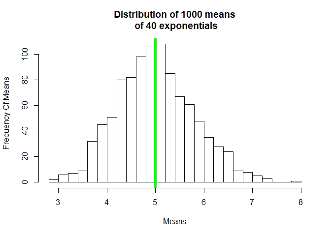
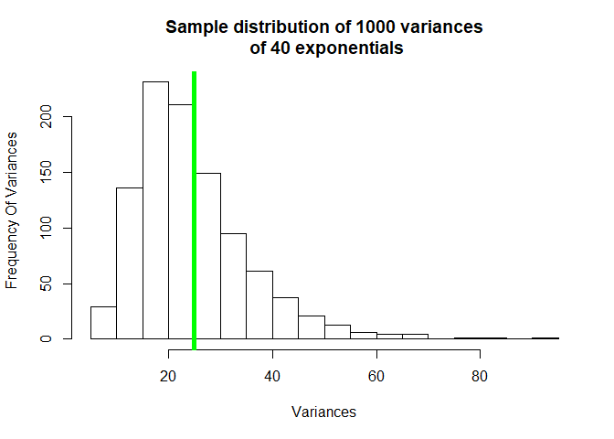
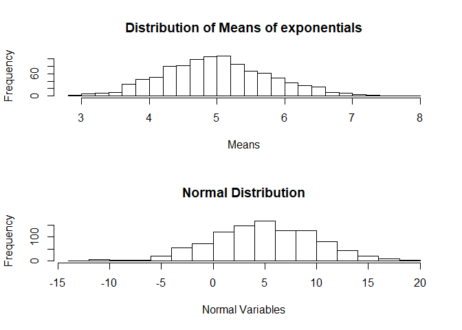

# Part1
## 1. Show the sample mean and compare it to the theoretical mean of the distribution.


```r
lambda<-0.2
mysim<-matrix(rexp(1000*40,lambda),nrow=1000,ncol=40)
```

### The average of the 1000 means of the 40 exponentials :

```r
mymean<-apply(mysim,1,mean)
mean(mymean)
```

```
## [1] 4.999252
```

### The Theoretical mean:

```r
1/lambda
```

```
## [1] 5
```
### Comparing Theoretical and sample mean:

```r
hist(mymean,main="Distribution of 1000 means\n of 40 exponentials",xlab="Means",ylab="Frequency Of Means",breaks = 20)
abline(v=1/lambda,col="green",lwd=5)
```

<!-- -->

We could see that both the center of the means distribution and the green vertical line of theoretical mean
are very closed to each other.

## 2. Show how variable the sample is (via variance) and compare it to the theoretical variance of the distribution.

### The average of the 1000 variances of the 40 exponentials :

```r
myvar<-apply(mysim,1,var)
mean(myvar)
```

```
## [1] 24.60762
```

### The Theoretical var:

```r
TheVar<-(1/lambda)^2
TheVar
```

```
## [1] 25
```
### Comparing Theoretical and sample Variance:

```r
hist(myvar,main="Sample distribution of 1000 variances\n of 40 exponentials",xlab="Variances",ylab="Frequency Of Variances",breaks = 20)
abline(v=TheVar,col="green",lwd=5)
```

<!-- -->

We could see that both the center of the sample Variances distribution and the green vertical line of theoretical Variance are very closed to each other.

## 3. Show that the distribution is approximately normal.


```r
par(mfrow=c(2,1))
hist(mymean,breaks = 20,main="Distribution of Means of exponentials",xlab="Means",ylab="Frequency")
hist(rnorm(1000,mean=1/lambda,sd=1/lambda),breaks = 20,main="Normal Distribution",xlab="Normal Variables",ylab="Frequency")
```

<!-- -->

The above graphs show how the distribution of means of exponentials is approximately a normal distribution with the same Mean and same Standard deviation.


