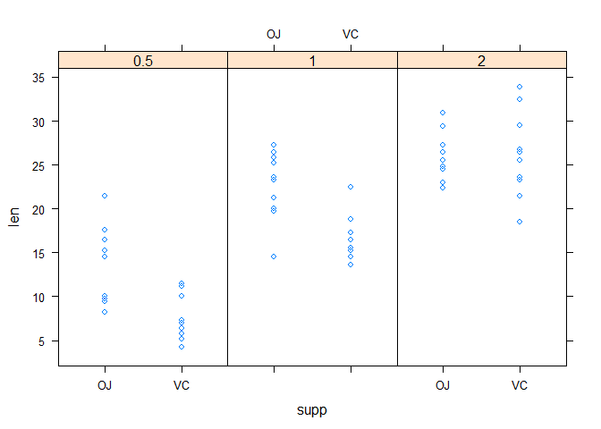

# Part2
##1. Load the ToothGrowth data and perform some basic exploratory data analyses.

```r
str(ToothGrowth)
```

```
## 'data.frame':	60 obs. of  3 variables:
##  $ len : num  4.2 11.5 7.3 5.8 6.4 10 11.2 11.2 5.2 7 ...
##  $ supp: Factor w/ 2 levels "OJ","VC": 2 2 2 2 2 2 2 2 2 2 ...
##  $ dose: num  0.5 0.5 0.5 0.5 0.5 0.5 0.5 0.5 0.5 0.5 ...
```

```r
library(lattice)
xyplot(len~supp|as.factor(dose),data=ToothGrowth,layout=c(3,1))
```

<!-- -->

* The above graph is a lattice plot depicting relation between tooth length and supplement for three different doses.
* It shows how there is a difference i tooth growth with different amount of dose.

##2. Provide a basic summary of the data.

```r
summary(ToothGrowth)
```

```
##       len        supp         dose      
##  Min.   : 4.20   OJ:30   Min.   :0.500  
##  1st Qu.:13.07   VC:30   1st Qu.:0.500  
##  Median :19.25           Median :1.000  
##  Mean   :18.81           Mean   :1.167  
##  3rd Qu.:25.27           3rd Qu.:2.000  
##  Max.   :33.90           Max.   :2.000
```

```r
sd(ToothGrowth$len)
```

```
## [1] 7.649315
```

The above summary shows that overall(including both supplement), the mean length of the tooth is 18.81 and standard deviation is 7.6.


```r
summary(ToothGrowth[ToothGrowth$supp=="OJ",]) 
```

```
##       len        supp         dose      
##  Min.   : 8.20   OJ:30   Min.   :0.500  
##  1st Qu.:15.53   VC: 0   1st Qu.:0.500  
##  Median :22.70           Median :1.000  
##  Mean   :20.66           Mean   :1.167  
##  3rd Qu.:25.73           3rd Qu.:2.000  
##  Max.   :30.90           Max.   :2.000
```

```r
sd(ToothGrowth[ToothGrowth$supp=="OJ",]$len)
```

```
## [1] 6.605561
```

The above summary shows that the mean length of tooth is 20.66 and standard deviation is 6.6 for "OJ" supplement.


```r
summary(ToothGrowth[ToothGrowth$supp=="VC",]) 
```

```
##       len        supp         dose      
##  Min.   : 4.20   OJ: 0   Min.   :0.500  
##  1st Qu.:11.20   VC:30   1st Qu.:0.500  
##  Median :16.50           Median :1.000  
##  Mean   :16.96           Mean   :1.167  
##  3rd Qu.:23.10           3rd Qu.:2.000  
##  Max.   :33.90           Max.   :2.000
```

```r
sd(ToothGrowth[ToothGrowth$supp=="VC",]$len)
```

```
## [1] 8.266029
```

The above summary shows that the mean length of tooth is 16.96 and standard deviation is 8.26 for "VC" supplement.


## 3. Use confidence intervals and/or hypothesis tests to compare tooth growth by supp and dose.


```r
t.test(ToothGrowth$len)$conf.int
```

```
## [1] 16.83731 20.78936
## attr(,"conf.level")
## [1] 0.95
```
From above result we could see that the 95 percent confidence interval lies from 16.84 to 20.7893.
So if we assume that the ToothGrowth is normally distributed then 95% of the time the true population mean would lie under this interval and NULL hypothesis would state that there is no difference between Tooth growth regardless of any supplements or doses.

### Now, let's test the NULL Hypothsesis.
### Analysing Tooth growth on the basis of Supplement.

```r
mean(ToothGrowth[ToothGrowth$supp=='OJ',]$len)
```

```
## [1] 20.66333
```

```r
mean(ToothGrowth[ToothGrowth$supp=='VC',]$len)
```

```
## [1] 16.96333
```
From above results we could see that mean tooth growth after taking 'OJ' supplement is 20.66 and mean tooth growth after taking 'VC' suppplement is 16.96. Clearly these means are under the confidence interval we had calculated above(16.84 to 20.789)

So we failed to reject the NULL hypothesis that there is no difference in tooth growth after taking any supplement.

### Comparing Tooth growth on the basis of dose amount.

```r
mean(ToothGrowth[ToothGrowth$dose==0.5,]$len)
```

```
## [1] 10.605
```

```r
mean(ToothGrowth[ToothGrowth$dose==1,]$len)
```

```
## [1] 19.735
```

```r
mean(ToothGrowth[ToothGrowth$dose==2,]$len)
```

```
## [1] 26.1
```
From above results we could see that mean tooth growth after taking 0.5 dose of the supplement is 20.66, likewise mean tooth growth after taking 1 dose of the suppplement is 19.73 and similary mean tooth growth after taking 2 dose of the suppplement is 26.1. 

**Since our confidence interval we had calculated above is from 16.84 to 20.789, 
hence we could reject the NULL hyothesis that there is no difference in tooth growth after taking any doses of the supplement.**
  
**This depicts that tooth growth is not normally distributed under each dose.**
  
**In order to compare the tooth growth on the basis of supplements for each dose let's assume that tooth growth is normally distributed under each dose or in other words there is no difference between means of tooth growth for different doses.**

### Analysing tooth growth for supplements with dose = 0.5

```r
dose_0.5<-ToothGrowth[ToothGrowth$dose==0.5,]
t.test(dose_0.5$len)$conf.int
```

```
## [1]  8.499046 12.710954
## attr(,"conf.level")
## [1] 0.95
```
The above calculation shows that for dose=0.5(considering it normally distributed), 95% confidence interval is ranging from 8.49 to 12.71, so the NULL hypothesis says that there shouldn't be any difference in tooth growth for any Supplement with dose=0.5 and 95% of the times it lies between the confidence interval ranging from 8.49 to 12.71.


```r
mean(dose_0.5[dose_0.5$supp=='OJ',]$len)
```

```
## [1] 13.23
```

```r
mean(dose_0.5[dose_0.5$supp=='VC',]$len)
```

```
## [1] 7.98
```
**Since the mean tooth growth with supplement 'OJ' is 13.23 and with 'VC' it is 7.98 under dose=0.5 and both are out of the confidence interval (8.49 - 12.71), we reject the NULL hypothesis that there is no difference in tooth growth with dose=0.5.**
  
### Analysing tooth growth for supplements with dose = 1

```r
dose_1<-ToothGrowth[ToothGrowth$dose==1,]
t.test(dose_1$len)$conf.int
```

```
## [1] 17.66851 21.80149
## attr(,"conf.level")
## [1] 0.95
```
The above calculation shows that for dose=1(considering it normally distributed), 95% confidence interval is ranging from 17.668 to 21.801, so the NULL hypothesis says that there shouldn't be any difference in tooth growth for any Supplement with dose=1 and 95% of the times it lies between the confidence interval ranging from 17.668 to 21.801.


```r
mean(dose_1[dose_1$supp=='OJ',]$len)
```

```
## [1] 22.7
```

```r
mean(dose_1[dose_1$supp=='VC',]$len)
```

```
## [1] 16.77
```
**Since the mean tooth growth with supplement 'OJ' is 22.7 and with 'VC' it is 16.77 under dose=1 and both are out of the confidence interval (17.668 - 21.801), we reject the NULL hypothesis that there is no difference in tooth growth with dose=1.**
  
### Analysing tooth growth for supplements with dose = 2

```r
dose_2<-ToothGrowth[ToothGrowth$dose==2,]
t.test(dose_2$len)$conf.int
```

```
## [1] 24.33364 27.86636
## attr(,"conf.level")
## [1] 0.95
```
The above calculation shows that for dose=2(considering it normally distributed), 95% confidence interval is ranging from 24.33 to 27.866, so the NULL hypothesis says that there shouldn't be any difference in tooth growth for any Supplement with dose=2 and 95% of the times it lies between the confidence interval ranging from 24.33 to 27.866.


```r
mean(dose_2[dose_2$supp=='OJ',]$len)
```

```
## [1] 26.06
```

```r
mean(dose_2[dose_2$supp=='VC',]$len)
```

```
## [1] 26.14
```
**Since the mean tooth growth with supplement 'OJ' is 26.06 and with 'VC' it is 26.14 under dose=2 and both are out of the confidence interval (24.33 - 27.866), so this time we fail to reject the NULL hypothesis and there is no difference in tooth growth.**
  
## 4.State your conclusions and the assumptions needed for your conclusions.
  
### Conculsion: 
* There is no difference in tooth growth despite different supplement.
* There is a difference in tooth growth for different supplements(OJ and VC) with dose = 0.5,
* There is a difference in tooth growth for different supplements(OJ and VC) with dose = 1
* but there is no difference in tooth growth for different supplements(OJ and VC) with dose = 2.

### Assumption:
* In order to test the NULL hyptohesis on the basis of supplements We assumed that ToothGrowth is a normal distriubuted dataset.
* In order to test the NULL hypothesis on the basis of supplements for different doses we assumed that datset for different doses is Normally distributed.
